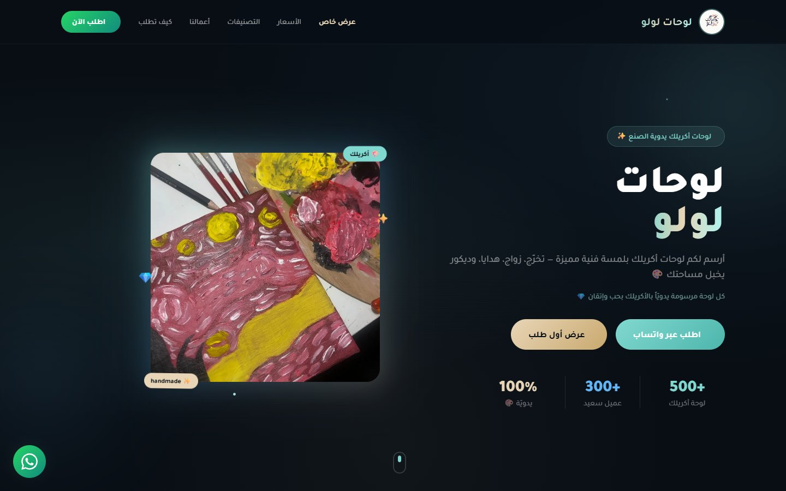
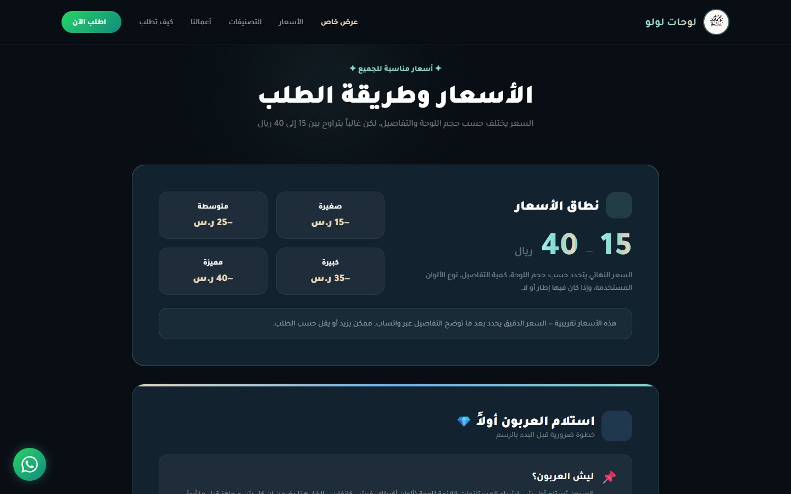

# لوحات لولو — Lulu's Acrylic Art

A one-page storefront for a small, home-based **hand-painted acrylic art** business: custom paintings for gifts, graduations, weddings, occasions and home décor. Orders go straight to WhatsApp, so the shop runs with no backend, no cart and no payment gateway.

**Live:** https://abdullah2036.github.io/artmaher/



## What's on the page

| Section | Content |
|---|---|
| **Hero** | tagline, "order via WhatsApp" and "first-order offer" buttons, stats |
| **First-order offer** | a one-time 10 SAR offer for new customers; claiming it is remembered in the browser |
| **Pricing** | price range (15–40 SAR) by size, and why a deposit is taken first |
| **Categories** | acrylic paintings · gifts · graduation · weddings · occasions · décor, each with its own pre-filled WhatsApp order |
| **Gallery** | examples of finished work |
| **How to order · testimonials · features** | the ordering steps, customer quotes, and what makes the shop different |
| **Contact** | final call-to-action and a floating WhatsApp button |

## Screenshots

| Pricing | Phone |
|---|---|
|  |  |

## Tech stack

- A single `index.html` with **Tailwind CSS** (Play CDN) and a custom theme config
- **Iconify** icons and the **Tajawal** Arabic font
- Vanilla JavaScript: mobile menu, scroll reveal (`IntersectionObserver`), smooth scrolling, toasts, WhatsApp order links, `localStorage` for the one-time offer
- Arabic, RTL, mobile-first

## Run locally

```bash
git clone https://github.com/abdullah2036/artmaher.git
cd artmaher
python -m http.server 8000       # or just open index.html in a browser
```

## Project structure

```
artmaher/
└── index.html    markup, Tailwind config, styles and scripts in one file
```

---

Built by **Abdullah Bokhary** · [Portfolio](https://abdullah.pageui.workers.dev/) · [LinkedIn](https://www.linkedin.com/in/abdullah-bokhary-840315326/) · [GitHub](https://github.com/abdullah2036)
